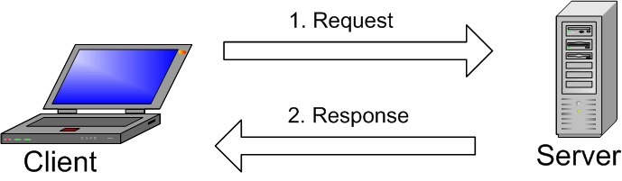

First things first, you have to know how to pronounce it: MY-ES-KYOO-EL’ [maɪˌɛsˌkjuːˈɛl]. Sometimes people call it “my sequel” or other names, but at least you know the official pronunciation. A Swedish company called MySQL AB originally developed MySQL in 1994. The US tech company Sun Microsystems then took full ownership when they bought MySQL AB in 2008. US tech giant Oracle in 2010 acquired Sun Microsystems itself, and MySQL has been practically owned by Oracle since.

In regard to the general definition, MySQL is an open source relational database management system (RDBMS) with a client-server model. RDBMS is a software or service used to create and manage databases based on a relational model. Now, let’s take a closer look at each term:

#### Database
A database is simply a collection of structured data. Think of taking a selfie: you push a button and capture an image of yourself. Your photo is data, and your phone’s gallery is the database. A database is a place in which data is stored and organized. The word “relational” means that the data stored in the dataset is organized as tables. Every table relates in some ways. If the software doesn’t support the relational data model, just call it DBMS.

#### Open source
Open source means that you’re free to use and modify it. Anybody can install the software. You can also learn and customize the source code to better accommodate your needs. However, The GPL (GNU Public License) determines what you can do depending on conditions. The commercially licensed version is available if you need more flexible ownership and advanced support.

#### Client-server model
Computers that install and run RDBMS software are called clients. Whenever they need to access data, they connect to the RDBMS server. That’s the “client-server” part.

MySQL is one of many RDBMS software options. RDBMS and MySQL are often thought to be the same because of MySQL’s popularity. A few big web applications like Facebook, Twitter, YouTube, Google, and Yahoo! all use MySQL for data storage purposes. Even though it was initially created for limited usage, it is now compatible with many important computing platforms like Linux, macOS, Microsoft Windows, and Ubuntu.

#### SQL
**MySQL and SQL are not the same**. Be aware that MySQL is one of the most popular RDBMS software’s brand names, which implements a client-server model. So, how do the client and server communicate in an RDBMS environment? They use a domain-specific language – Structured Query Language (SQL). If you ever encounter other names that have SQL in them, like PostgreSQL and Microsoft SQL server, they are most likely brands which also use Structured Query Language syntax. RDBMS software is often written in other programming languages, but always use SQL as their primary language to interact with the database. MySQL itself is written in C and C++.

Computer scientist Ted Codd developed SQL in the early 1970s with an IBM based relational model. It became more widely used in 1974 and quickly replaced similar, then-outdated languages, ISAM and VISAM. History aside, SQL tells the server what to do with the data. It is similar to your WordPress password or code. You input it into the system to gain access to the dashboard area. In this case, SQL statements can instruct the server to perform certain operations:

- Data query: requesting specific information from the existing database.
- Data manipulation: adding, deleting, changing, sorting, and other operations to modify the data, the values or the visuals.
- Data identity: defining data types, e.g. changing numerical data to integers. This also includes defining a schema or the relationship of each table in the database
- Data access control: providing security techniques to protect data, this includes deciding who can view or use any information stored in the database

### How Does MySQL Work?

  

The image explains the basic structure of the client-server structure. One or more devices (clients) connect to a server through a specific network. Every client can make a request from the graphical user interface (GUI) on their screens, and the server will produce the desired output, as long as both ends understand the instruction. Without getting too technical, the main processes taking place in a MySQL environment are the same, which are:

1. MySQL creates a database for storing and manipulating data, defining the relationship of each table.
2. Clients can make requests by typing specific SQL statements on MySQL.
3. The server application will respond with the requested information and it will appear on the clients’ side.   

That’s pretty much it. From the clients’ side, they usually emphasize which MySQL GUI to use. The lighter and more user-friendly the GUI is, the faster and easier their data management activities will be. Some of the most popular MySQL GUIs are MySQL WorkBench, SequelPro, DBVisualizer, and the Navicat DB Admin Tool. Some of them are free, while some are commercial, some run exclusively for macOS, and some are compatible with major operating systems. Clients should choose the GUI depending on their needs. For web database management, including a WordPress site, the most obvious go-to is phpMyAdmin.