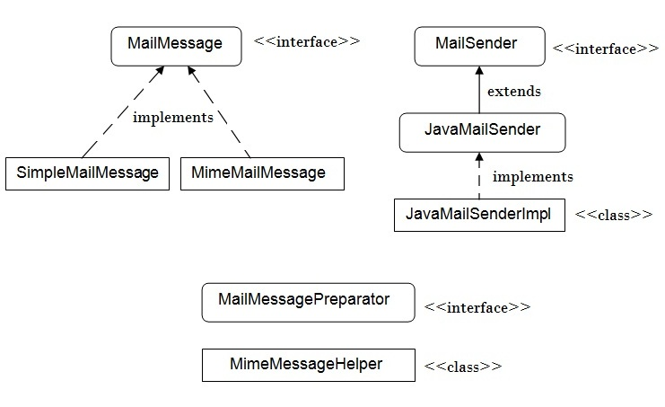

Spring framework provides many useful interfaces and classes for sending and receiving mails.

The **org.springframework.mail** package is the root package that provides mail support in Spring framework.   

The interfaces and classes for java mail support in spring framework are as follows:  

  

1. **MailSender interface**: It is the root interface. It provides basic functionality for sending simple mails.
1. **JavaMailSender interface**: It is the subinterface of MailSender. It supports MIME messages. It is mostly used with MimeMessageHelper class for the creation of JavaMail MimeMessage, with attachment etc. The spring framework recommends MimeMessagePreparator mechanism for using this interface.
1. **JavaMailSenderImpl class**: It provides the implementation of JavaMailSender interface. It supports JavaMail MimeMessages and Spring SimpleMailMessages.
1. **SimpleMailMessage clas**s: It is used to create a simple mail message including from, to, cc, subject and text messages.
1. **MimeMessagePreparator interfac**e: It is the callback interface for the preparation of JavaMail MIME messages.
1. **MimeMessageHelper class**: It is the helper class for creating a MIME message. It offers support for inline elements such as images, typical mail attachments and HTML text content.